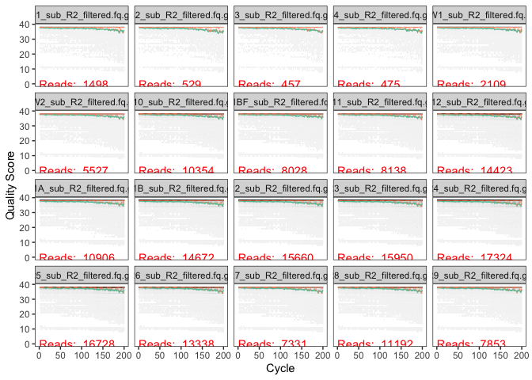
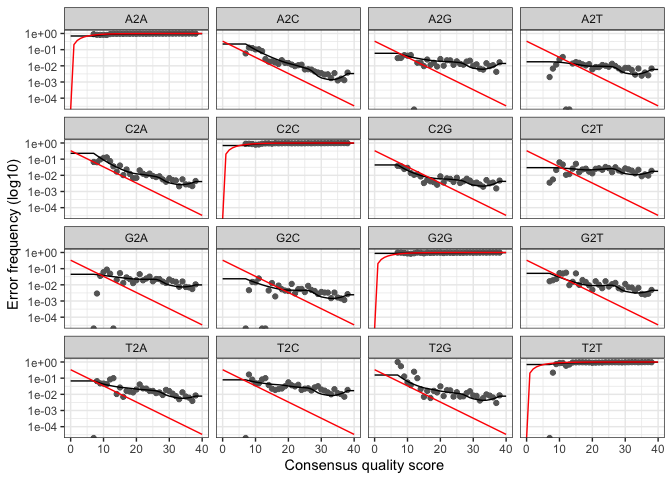

# Amplicon Analysis

-   I will be analyzing an amplicon dataset generated from DNA found in
    crushed basalts. The samples were collected in an underwater
    mountain in the pacific ocean. I will be using a subset of this 
    <data:https://www.frontiersin.org/articles/10.3389/fmicb.2015.01470/full>.
-   I will be closely following the analysis performed here:
    <https://astrobiomike.github.io/amplicon/dada2_workflow_ex#extracting-the-standard-goods-from-dada2>
-   I hope to gain a basic understanding of amplicon analysis in R.

## Setting up our conda environment

The following code was executed in terminal.

    conda create --name ampliconanalysis
    conda activate ampliconanalysis
    conda install -y -c conda-forge mamba

    mamba create -y -n hb-dada2-ex-wf -c conda-forge -c bioconda -c defaults \
                 cutadapt=2.3 r-base=3.6.3 rstudio=1.1.456 r-tidyverse=1.3.0 \
                 r-vegan=2.5 r-dendextend=1.14.0 r-viridis=0.6 \
                 bioconductor-phyloseq=1.30 bioconductor-deseq2=1.26 bioconductor-dada2=1.14 \
                 bioconductor-decipher=2.14 bioconductor-decontam=1.6 r-biocmanager=1.30 \
                 r-matrix=1.3_2 libopenblas=0.3.7

    conda activate hb-dada2-ex-wf

Now we get the data and make a file with the sample names. The following
was exectued in terminal.

    cd ~
    curl -L -o dada2_amplicon_ex_workflow.tar.gz https://ndownloader.figshare.com/files/28773936
    tar -xzvf dada2_amplicon_ex_workflow.tar.gz
    rm dada2_amplicon_ex_workflow.tar.gz
    cd dada2_amplicon_ex_workflow/
    ls *_R1.fq | cut -f1 -d "_" > samples 

Now we must remove all the primers from our samples. Our primers can be
found in the primers.fa file.

    for sample in $(cat samples)
    do

        echo "On sample: $sample"
        
        cutadapt -a ^GTGCCAGCMGCCGCGGTAA...ATTAGAWACCCBDGTAGTCC \
                 -A ^GGACTACHVGGGTWTCTAAT...TTACCGCGGCKGCTGGCAC \
                 -m 215 -M 285 --discard-untrimmed \
                 -o ${sample}_sub_R1_trimmed.fq.gz -p ${sample}_sub_R2_trimmed.fq.gz \
                 ${sample}_sub_R1.fq ${sample}_sub_R2.fq \
                 >> cutadapt_primer_trimming_stats.txt 2>&1

    done

Check and see what fraction of reads and base pairs were retained in
each sample.

    paste samples <(grep "passing" cutadapt_primer_trimming_stats.txt | cut -f3 -d "(" | tr -d ")") <(grep "filtered" cutadapt_primer_trimming_stats.txt | cut -f3 -d "(" | tr -d ")")

## Data Processing in R

Next we move to R to begin processing our data.

    library(dada2)

    ## Loading required package: Rcpp

    packageVersion("dada2") # import packages

    ## [1] '1.14.0'

    #setwd("~/dada2_amplicon_ex_workflow") # set working directory
    ## first we're setting a few variables we're going to use ##
    # one with all sample names, by scanning our "samples" file we made earlier
    samples <- scan("samples", what="character")

    # we create one holding the file names of all the forward reads
    forward_reads <- paste0(samples, "_sub_R1_trimmed.fq.gz")

    # and one with the reverse
    reverse_reads <- paste0(samples, "_sub_R2_trimmed.fq.gz")

    # and variables holding file names for the forward and reverse
    # filtered reads we're going to generate below
    filtered_forward_reads <- paste0(samples, "_sub_R1_filtered.fq.gz")
    filtered_reverse_reads <- paste0(samples, "_sub_R2_filtered.fq.gz")

Now we’ll take a look at the quality profile of our untrimmed reads

    ## Scale for 'y' is already present. Adding another scale for 'y', which will
    ## replace the existing scale.

    ## Scale for 'y' is already present. Adding another scale for 'y', which will
    ## replace the existing scale.

    ## Scale for 'y' is already present. Adding another scale for 'y', which will
    ## replace the existing scale.

There is a dropoff in quality of the reads starting at around length
200. We will therefore cut the forward reads to length 250 and reverse
reads to length 200. Our goal is to keep the quality scores above 30.

    filtered_out <- filterAndTrim(forward_reads, filtered_forward_reads,
                                  reverse_reads, filtered_reverse_reads, maxEE=c(2,2),
                                  rm.phix=TRUE, minLen=175, truncLen=c(250,200))

Now lets take a look at the quality profile of our trimmed sequences.

Now lets take a look at an error model of our dataset.

    err_forward_reads <- learnErrors(filtered_forward_reads, multithread=TRUE) 

    ## 45623000 total bases in 182492 reads from 20 samples will be used for learning the error rates.

    err_reverse_reads <- learnErrors(filtered_reverse_reads, multithread=TRUE) 

    ## 36498400 total bases in 182492 reads from 20 samples will be used for learning the error rates.

Now we take a look at how well our estimated error matches up with our
observed error.

    plotErrors(err_forward_reads, nominalQ=TRUE)

    ## Warning: Transformation introduced infinite values in continuous y-axis

    ## Warning: Transformation introduced infinite values in continuous y-axis

    plotErrors(err_reverse_reads, nominalQ=TRUE)

    ## Warning: Transformation introduced infinite values in continuous y-axis

    ## Warning: Transformation introduced infinite values in continuous y-axis

Now we perform dereplication to remove identical sequences.

    derep_forward <- derepFastq(filtered_forward_reads, verbose=TRUE)

    ## Dereplicating sequence entries in Fastq file: B1_sub_R1_filtered.fq.gz

    ## Encountered 552 unique sequences from 1498 total sequences read.

    ## Dereplicating sequence entries in Fastq file: B2_sub_R1_filtered.fq.gz

    ## Encountered 224 unique sequences from 529 total sequences read.

    ## Dereplicating sequence entries in Fastq file: B3_sub_R1_filtered.fq.gz

    ## Encountered 186 unique sequences from 457 total sequences read.

    ## Dereplicating sequence entries in Fastq file: B4_sub_R1_filtered.fq.gz

    ## Encountered 203 unique sequences from 475 total sequences read.

    ## Dereplicating sequence entries in Fastq file: BW1_sub_R1_filtered.fq.gz

    ## Encountered 723 unique sequences from 2109 total sequences read.

    ## Dereplicating sequence entries in Fastq file: BW2_sub_R1_filtered.fq.gz

    ## Encountered 2760 unique sequences from 5527 total sequences read.

    ## Dereplicating sequence entries in Fastq file: R10_sub_R1_filtered.fq.gz

    ## Encountered 5501 unique sequences from 10354 total sequences read.

    ## Dereplicating sequence entries in Fastq file: R11BF_sub_R1_filtered.fq.gz

    ## Encountered 3452 unique sequences from 8028 total sequences read.

    ## Dereplicating sequence entries in Fastq file: R11_sub_R1_filtered.fq.gz

    ## Encountered 4846 unique sequences from 8138 total sequences read.

    ## Dereplicating sequence entries in Fastq file: R12_sub_R1_filtered.fq.gz

    ## Encountered 9747 unique sequences from 14423 total sequences read.

    ## Dereplicating sequence entries in Fastq file: R1A_sub_R1_filtered.fq.gz

    ## Encountered 6894 unique sequences from 10906 total sequences read.

    ## Dereplicating sequence entries in Fastq file: R1B_sub_R1_filtered.fq.gz

    ## Encountered 9380 unique sequences from 14672 total sequences read.

    ## Dereplicating sequence entries in Fastq file: R2_sub_R1_filtered.fq.gz

    ## Encountered 9310 unique sequences from 15660 total sequences read.

    ## Dereplicating sequence entries in Fastq file: R3_sub_R1_filtered.fq.gz

    ## Encountered 10225 unique sequences from 15950 total sequences read.

    ## Dereplicating sequence entries in Fastq file: R4_sub_R1_filtered.fq.gz

    ## Encountered 10407 unique sequences from 17324 total sequences read.

    ## Dereplicating sequence entries in Fastq file: R5_sub_R1_filtered.fq.gz

    ## Encountered 10981 unique sequences from 16728 total sequences read.

    ## Dereplicating sequence entries in Fastq file: R6_sub_R1_filtered.fq.gz

    ## Encountered 8520 unique sequences from 13338 total sequences read.

    ## Dereplicating sequence entries in Fastq file: R7_sub_R1_filtered.fq.gz

    ## Encountered 4432 unique sequences from 7331 total sequences read.

    ## Dereplicating sequence entries in Fastq file: R8_sub_R1_filtered.fq.gz

    ## Encountered 6171 unique sequences from 11192 total sequences read.

    ## Dereplicating sequence entries in Fastq file: R9_sub_R1_filtered.fq.gz

    ## Encountered 4234 unique sequences from 7853 total sequences read.

    names(derep_forward) <- samples # the sample names in these objects are initially the file names of the samples, this sets them to the sample names for the rest of the workflow
    derep_reverse <- derepFastq(filtered_reverse_reads, verbose=TRUE)

    ## Dereplicating sequence entries in Fastq file: B1_sub_R2_filtered.fq.gz

    ## Encountered 514 unique sequences from 1498 total sequences read.

    ## Dereplicating sequence entries in Fastq file: B2_sub_R2_filtered.fq.gz

    ## Encountered 203 unique sequences from 529 total sequences read.

    ## Dereplicating sequence entries in Fastq file: B3_sub_R2_filtered.fq.gz

    ## Encountered 171 unique sequences from 457 total sequences read.

    ## Dereplicating sequence entries in Fastq file: B4_sub_R2_filtered.fq.gz

    ## Encountered 189 unique sequences from 475 total sequences read.

    ## Dereplicating sequence entries in Fastq file: BW1_sub_R2_filtered.fq.gz

    ## Encountered 660 unique sequences from 2109 total sequences read.

    ## Dereplicating sequence entries in Fastq file: BW2_sub_R2_filtered.fq.gz

    ## Encountered 2506 unique sequences from 5527 total sequences read.

    ## Dereplicating sequence entries in Fastq file: R10_sub_R2_filtered.fq.gz

    ## Encountered 5054 unique sequences from 10354 total sequences read.

    ## Dereplicating sequence entries in Fastq file: R11BF_sub_R2_filtered.fq.gz

    ## Encountered 3113 unique sequences from 8028 total sequences read.

    ## Dereplicating sequence entries in Fastq file: R11_sub_R2_filtered.fq.gz

    ## Encountered 4568 unique sequences from 8138 total sequences read.

    ## Dereplicating sequence entries in Fastq file: R12_sub_R2_filtered.fq.gz

    ## Encountered 9288 unique sequences from 14423 total sequences read.

    ## Dereplicating sequence entries in Fastq file: R1A_sub_R2_filtered.fq.gz

    ## Encountered 6445 unique sequences from 10906 total sequences read.

    ## Dereplicating sequence entries in Fastq file: R1B_sub_R2_filtered.fq.gz

    ## Encountered 8799 unique sequences from 14672 total sequences read.

    ## Dereplicating sequence entries in Fastq file: R2_sub_R2_filtered.fq.gz

    ## Encountered 8762 unique sequences from 15660 total sequences read.

    ## Dereplicating sequence entries in Fastq file: R3_sub_R2_filtered.fq.gz

    ## Encountered 9710 unique sequences from 15950 total sequences read.

    ## Dereplicating sequence entries in Fastq file: R4_sub_R2_filtered.fq.gz

    ## Encountered 9613 unique sequences from 17324 total sequences read.

    ## Dereplicating sequence entries in Fastq file: R5_sub_R2_filtered.fq.gz

    ## Encountered 10432 unique sequences from 16728 total sequences read.

    ## Dereplicating sequence entries in Fastq file: R6_sub_R2_filtered.fq.gz

    ## Encountered 8047 unique sequences from 13338 total sequences read.

    ## Dereplicating sequence entries in Fastq file: R7_sub_R2_filtered.fq.gz

    ## Encountered 4145 unique sequences from 7331 total sequences read.

    ## Dereplicating sequence entries in Fastq file: R8_sub_R2_filtered.fq.gz

    ## Encountered 5696 unique sequences from 11192 total sequences read.

    ## Dereplicating sequence entries in Fastq file: R9_sub_R2_filtered.fq.gz

    ## Encountered 3970 unique sequences from 7853 total sequences read.

    names(derep_reverse) <- samples

## Lets Infer ASVs

We start by pseudo-pooling our data and merging our forward and reverse
reads to generate a complete amplicon. We have set the minimum BP
overlap to be 170. We then generate a table count and examine it.

    dada_forward <- dada(derep_forward, err=err_forward_reads, pool="pseudo")

    ## Sample 1 - 1498 reads in 552 unique sequences.
    ## Sample 2 - 529 reads in 224 unique sequences.
    ## Sample 3 - 457 reads in 186 unique sequences.
    ## Sample 4 - 475 reads in 203 unique sequences.
    ## Sample 5 - 2109 reads in 723 unique sequences.
    ## Sample 6 - 5527 reads in 2760 unique sequences.
    ## Sample 7 - 10354 reads in 5501 unique sequences.
    ## Sample 8 - 8028 reads in 3452 unique sequences.
    ## Sample 9 - 8138 reads in 4846 unique sequences.
    ## Sample 10 - 14423 reads in 9747 unique sequences.
    ## Sample 11 - 10906 reads in 6894 unique sequences.
    ## Sample 12 - 14672 reads in 9380 unique sequences.
    ## Sample 13 - 15660 reads in 9310 unique sequences.
    ## Sample 14 - 15950 reads in 10225 unique sequences.
    ## Sample 15 - 17324 reads in 10407 unique sequences.
    ## Sample 16 - 16728 reads in 10981 unique sequences.
    ## Sample 17 - 13338 reads in 8520 unique sequences.
    ## Sample 18 - 7331 reads in 4432 unique sequences.
    ## Sample 19 - 11192 reads in 6171 unique sequences.
    ## Sample 20 - 7853 reads in 4234 unique sequences.
    ## 
    ##    selfConsist step 2

    dada_reverse <- dada(derep_reverse, err=err_reverse_reads, pool="pseudo")

    ## Sample 1 - 1498 reads in 514 unique sequences.
    ## Sample 2 - 529 reads in 203 unique sequences.
    ## Sample 3 - 457 reads in 171 unique sequences.
    ## Sample 4 - 475 reads in 189 unique sequences.
    ## Sample 5 - 2109 reads in 660 unique sequences.
    ## Sample 6 - 5527 reads in 2506 unique sequences.
    ## Sample 7 - 10354 reads in 5054 unique sequences.
    ## Sample 8 - 8028 reads in 3113 unique sequences.
    ## Sample 9 - 8138 reads in 4568 unique sequences.
    ## Sample 10 - 14423 reads in 9288 unique sequences.
    ## Sample 11 - 10906 reads in 6445 unique sequences.
    ## Sample 12 - 14672 reads in 8799 unique sequences.
    ## Sample 13 - 15660 reads in 8762 unique sequences.
    ## Sample 14 - 15950 reads in 9710 unique sequences.
    ## Sample 15 - 17324 reads in 9613 unique sequences.
    ## Sample 16 - 16728 reads in 10432 unique sequences.
    ## Sample 17 - 13338 reads in 8047 unique sequences.
    ## Sample 18 - 7331 reads in 4145 unique sequences.
    ## Sample 19 - 11192 reads in 5696 unique sequences.
    ## Sample 20 - 7853 reads in 3970 unique sequences.
    ## 
    ##    selfConsist step 2

    merged_amplicons <- mergePairs(dada_forward, derep_forward, dada_reverse,
                                   derep_reverse, trimOverhang=TRUE, minOverlap=170)
    seqtab <- makeSequenceTable(merged_amplicons)
    class(seqtab) 

    ## [1] "matrix"

    dim(seqtab)

    ## [1]   20 2521

Now we identify any chimera sequences in our data.

    seqtab.nochim <- removeBimeraDenovo(seqtab, verbose=T)

    ## Identified 17 bimeras out of 2521 input sequences.

    sum(seqtab.nochim)/sum(seqtab) #Check to see how much we lost in terms of abundance

    ## [1] 0.9931372

Now we check to see how many reads have been dropped throughout, and we
save the table.

    getN <- function(x) sum(getUniques(x))
    summary_tab <- data.frame(row.names=samples, dada2_input=filtered_out[,1],
                              filtered=filtered_out[,2], dada_f=sapply(dada_forward, getN),
                              dada_r=sapply(dada_reverse, getN), merged=sapply(merged_amplicons, getN),
                              nonchim=rowSums(seqtab.nochim),
                              final_perc_reads_retained=round(rowSums(seqtab.nochim)/filtered_out[,1]*100, 1))
    summary_tab

    ##       dada2_input filtered dada_f dada_r merged nonchim
    ## B1           1613     1498   1458   1466   1457    1457
    ## B2            591      529    523    524    523     523
    ## B3            503      457    450    451    450     450
    ## B4            507      475    440    447    439     439
    ## BW1          2294     2109   2066   2082   2054    2054
    ## BW2          6017     5527   5134   5229   4716    4716
    ## R10         11258    10354   9658   9819   9009    8847
    ## R11BF        8627     8028   7544   7640   7150    6960
    ## R11          8927     8138   7279   7511   6694    6577
    ## R12         15681    14423  12420  12932  10714   10649
    ## R1A         12108    10906   9584   9897   8559    8535
    ## R1B         16091    14672  12937  13389  11202   11158
    ## R2          17196    15660  14039  14498  12494   12436
    ## R3          17494    15950  14210  14662  12503   12444
    ## R4          18967    17324  16241  16501  14816   14750
    ## R5          18209    16728  14800  15332  12905   12818
    ## R6          14600    13338  11934  12311  10459   10448
    ## R7           8003     7331   6515   6726   5630    5618
    ## R8          12211    11192  10286  10513   9530    9454
    ## R9           8600     7853   7215   7390   6740    6695
    ##       final_perc_reads_retained
    ## B1                         90.3
    ## B2                         88.5
    ## B3                         89.5
    ## B4                         86.6
    ## BW1                        89.5
    ## BW2                        78.4
    ## R10                        78.6
    ## R11BF                      80.7
    ## R11                        73.7
    ## R12                        67.9
    ## R1A                        70.5
    ## R1B                        69.3
    ## R2                         72.3
    ## R3                         71.1
    ## R4                         77.8
    ## R5                         70.4
    ## R6                         71.6
    ## R7                         70.2
    ## R8                         77.4
    ## R9                         77.8

    write.table(summary_tab, "read-count-tracking.tsv", quote=FALSE, sep="\t", col.names=NA)

The following code block was skipped because it would be too time
consuming to run.

    ## downloading DECIPHER-formatted SILVA v138 reference
    download.file(url="http://www2.decipher.codes/Classification/TrainingSets/SILVA_SSU_r138_2019.RData", destfile="SILVA_SSU_r138_2019.RData")

    ## loading reference taxonomy object
    load("SILVA_SSU_r138_2019.RData")

    ## loading DECIPHER
    library(DECIPHER)
    packageVersion("DECIPHER") 
    ## creating DNAStringSet object of our ASVs
    dna <- DNAStringSet(getSequences(seqtab.nochim))

    ## and classifying
    tax_info <- IdTaxa(test=dna, trainingSet=trainingSet, strand="both", processors=NULL)

Instead, we load the output taxonomy object that would have been
created.

    load("tax-info.RData")

Now we generate a fasta file, count table, and taxonomy table from our
DADA2 objects.

    # giving our seq headers more manageable names (ASV_1, ASV_2...)
    asv_seqs <- colnames(seqtab.nochim)
    asv_headers <- vector(dim(seqtab.nochim)[2], mode="character")

    for (i in 1:dim(seqtab.nochim)[2]) {
      asv_headers[i] <- paste(">ASV", i, sep="_")
    }

    # making and writing out a fasta of our final ASV seqs:
    asv_fasta <- c(rbind(asv_headers, asv_seqs))
    write(asv_fasta, "ASVs.fa")

    # count table:
    asv_tab <- t(seqtab.nochim)
    row.names(asv_tab) <- sub(">", "", asv_headers)
    write.table(asv_tab, "ASVs_counts.tsv", sep="\t", quote=F, col.names=NA)

    # tax table:
    # creating table of taxonomy and setting any that are unclassified as "NA"
    ranks <- c("domain", "phylum", "class", "order", "family", "genus", "species")
    asv_tax <- t(sapply(tax_info, function(x) {
      m <- match(ranks, x$rank)
      taxa <- x$taxon[m]
      taxa[startsWith(taxa, "unclassified_")] <- NA
      taxa
    }))
    colnames(asv_tax) <- ranks
    rownames(asv_tax) <- gsub(pattern=">", replacement="", x=asv_headers)

    write.table(asv_tax, "ASVs_taxonomy.tsv", sep = "\t", quote=F, col.names=NA)

## Remove contaminant sequences

    library(decontam)
    packageVersion("decontam") 

    ## [1] '1.6.0'

    # identify contaminants 
    colnames(asv_tab) # our blanks are the first 4 of 20 samples in this case

    ##  [1] "B1"    "B2"    "B3"    "B4"    "BW1"   "BW2"   "R10"   "R11BF" "R11"  
    ## [10] "R12"   "R1A"   "R1B"   "R2"    "R3"    "R4"    "R5"    "R6"    "R7"   
    ## [19] "R8"    "R9"

    vector_for_decontam <- c(rep(TRUE, 4), rep(FALSE, 16))
    contam_df <- isContaminant(t(asv_tab), neg=vector_for_decontam)
    table(contam_df$contaminant) 

    ## 
    ## FALSE  TRUE 
    ##  2498     6

    contam_asvs <- row.names(contam_df[contam_df$contaminant == TRUE, ])
    # check out the contaminants
    asv_tax[row.names(asv_tax) %in% contam_asvs, ]

    ##         domain     phylum             class                 order              
    ## ASV_104 "Bacteria" "Proteobacteria"   "Gammaproteobacteria" NA                 
    ## ASV_219 "Bacteria" "Proteobacteria"   "Gammaproteobacteria" "Enterobacterales" 
    ## ASV_230 "Bacteria" "Proteobacteria"   "Gammaproteobacteria" NA                 
    ## ASV_274 "Bacteria" "Proteobacteria"   "Gammaproteobacteria" "Pseudomonadales"  
    ## ASV_285 "Bacteria" "Proteobacteria"   "Gammaproteobacteria" "Burkholderiales"  
    ## ASV_623 "Bacteria" "Actinobacteriota" "Actinobacteria"      "Corynebacteriales"
    ##         family               genus             species
    ## ASV_104 NA                   NA                NA     
    ## ASV_219 NA                   NA                NA     
    ## ASV_230 NA                   NA                NA     
    ## ASV_274 "Pseudomonadaceae"   "Pseudomonas"     NA     
    ## ASV_285 "Comamonadaceae"     "Tepidimonas"     NA     
    ## ASV_623 "Corynebacteriaceae" "Corynebacterium" NA

Now lets remove contaminants from outputs and create some new files

    # making new fasta file
    contam_indices <- which(asv_fasta %in% paste0(">", contam_asvs))
    dont_want <- sort(c(contam_indices, contam_indices + 1))
    asv_fasta_no_contam <- asv_fasta[- dont_want]

    # making new count table
    asv_tab_no_contam <- asv_tab[!row.names(asv_tab) %in% contam_asvs, ]

    # making new taxonomy table
    asv_tax_no_contam <- asv_tax[!row.names(asv_tax) %in% contam_asvs, ]

    ## and now writing them out to files
    write(asv_fasta_no_contam, "ASVs-no-contam.fa")
    write.table(asv_tab_no_contam, "ASVs_counts-no-contam.tsv",
                sep="\t", quote=F, col.names=NA)
    write.table(asv_tax_no_contam, "ASVs_taxonomy-no-contam.tsv",
                sep="\t", quote=F, col.names=NA)

## Analysis

    library(tidyverse) ; packageVersion("tidyverse")

    ## ── Attaching packages ─────────────────────────────────────── tidyverse 1.3.0 ──

    ## ✓ ggplot2 3.3.3     ✓ purrr   0.3.4
    ## ✓ tibble  3.1.2     ✓ dplyr   1.0.6
    ## ✓ tidyr   1.1.3     ✓ stringr 1.4.0
    ## ✓ readr   1.4.0     ✓ forcats 0.5.1

    ## ── Conflicts ────────────────────────────────────────── tidyverse_conflicts() ──
    ## x dplyr::filter() masks stats::filter()
    ## x dplyr::lag()    masks stats::lag()

    library(phyloseq) ; packageVersion("phyloseq") 
    library(vegan) ; packageVersion("vegan") 

    ## Loading required package: permute

    ## Loading required package: lattice

    ## This is vegan 2.5-6

    library(DESeq2) ; packageVersion("DESeq2") 

    ## Loading required package: S4Vectors

    ## Loading required package: stats4

    ## Loading required package: BiocGenerics

    ## Loading required package: parallel

    ## 
    ## Attaching package: 'BiocGenerics'

    ## The following objects are masked from 'package:parallel':
    ## 
    ##     clusterApply, clusterApplyLB, clusterCall, clusterEvalQ,
    ##     clusterExport, clusterMap, parApply, parCapply, parLapply,
    ##     parLapplyLB, parRapply, parSapply, parSapplyLB

    ## The following objects are masked from 'package:dplyr':
    ## 
    ##     combine, intersect, setdiff, union

    ## The following objects are masked from 'package:stats':
    ## 
    ##     IQR, mad, sd, var, xtabs

    ## The following objects are masked from 'package:base':
    ## 
    ##     anyDuplicated, append, as.data.frame, basename, cbind, colnames,
    ##     dirname, do.call, duplicated, eval, evalq, Filter, Find, get, grep,
    ##     grepl, intersect, is.unsorted, lapply, Map, mapply, match, mget,
    ##     order, paste, pmax, pmax.int, pmin, pmin.int, Position, rank,
    ##     rbind, Reduce, rownames, sapply, setdiff, sort, table, tapply,
    ##     union, unique, unsplit, which, which.max, which.min

    ## 
    ## Attaching package: 'S4Vectors'

    ## The following objects are masked from 'package:dplyr':
    ## 
    ##     first, rename

    ## The following object is masked from 'package:tidyr':
    ## 
    ##     expand

    ## The following object is masked from 'package:base':
    ## 
    ##     expand.grid

    ## Loading required package: IRanges

    ## 
    ## Attaching package: 'IRanges'

    ## The following object is masked from 'package:phyloseq':
    ## 
    ##     distance

    ## The following objects are masked from 'package:dplyr':
    ## 
    ##     collapse, desc, slice

    ## The following object is masked from 'package:purrr':
    ## 
    ##     reduce

    ## Loading required package: GenomicRanges

    ## Loading required package: GenomeInfoDb

    ## Loading required package: SummarizedExperiment

    ## Loading required package: Biobase

    ## Welcome to Bioconductor
    ## 
    ##     Vignettes contain introductory material; view with
    ##     'browseVignettes()'. To cite Bioconductor, see
    ##     'citation("Biobase")', and for packages 'citation("pkgname")'.

    ## 
    ## Attaching package: 'Biobase'

    ## The following object is masked from 'package:phyloseq':
    ## 
    ##     sampleNames

    ## Loading required package: DelayedArray

    ## Loading required package: matrixStats

    ## 
    ## Attaching package: 'matrixStats'

    ## The following objects are masked from 'package:Biobase':
    ## 
    ##     anyMissing, rowMedians

    ## The following object is masked from 'package:dplyr':
    ## 
    ##     count

    ## Loading required package: BiocParallel

    ## 
    ## Attaching package: 'DelayedArray'

    ## The following objects are masked from 'package:matrixStats':
    ## 
    ##     colMaxs, colMins, colRanges, rowMaxs, rowMins, rowRanges

    ## The following object is masked from 'package:purrr':
    ## 
    ##     simplify

    ## The following objects are masked from 'package:base':
    ## 
    ##     aperm, apply, rowsum

    library(dendextend) ; packageVersion("dendextend") 

    ## Registered S3 method overwritten by 'dendextend':
    ##   method     from 
    ##   rev.hclust vegan

    ## 
    ## ---------------------
    ## Welcome to dendextend version 1.14.0
    ## Type citation('dendextend') for how to cite the package.
    ## 
    ## Type browseVignettes(package = 'dendextend') for the package vignette.
    ## The github page is: https://github.com/talgalili/dendextend/
    ## 
    ## Suggestions and bug-reports can be submitted at: https://github.com/talgalili/dendextend/issues
    ## Or contact: <tal.galili@gmail.com>
    ## 
    ##  To suppress this message use:  suppressPackageStartupMessages(library(dendextend))
    ## ---------------------

    ## 
    ## Attaching package: 'dendextend'

    ## The following object is masked from 'package:permute':
    ## 
    ##     shuffle

    ## The following object is masked from 'package:stats':
    ## 
    ##     cutree

    library(viridis) ; packageVersion("viridis") 

    ## Loading required package: viridisLite

Clearing blank space from table, then taking a look

    count_tab <- read.table("ASVs_counts-no-contam.tsv", header=T, row.names=1,
                            check.names=F, sep="\t")[ , -c(1:4)]

    # Taking a look at our tables
    tax_tab <- as.matrix(read.table("ASVs_taxonomy-no-contam.tsv", header=T,
                                    row.names=1, check.names=F, sep="\t"))

    sample_info_tab <- read.table("sample_info.tsv", header=T, row.names=1,
                                  check.names=F, sep="\t")

    # and setting the color column to be of type "character", which helps later
    sample_info_tab$color <- as.character(sample_info_tab$color)
    sample_info_tab # to take a peek

    ##       temp    type      char      color
    ## BW1    2.0   water     water       blue
    ## BW2    2.0   water     water       blue
    ## R10   13.7    rock    glassy      black
    ## R11BF  7.3 biofilm   biofilm  darkgreen
    ## R11    7.3    rock    glassy      black
    ## R12     NA    rock   altered chocolate4
    ## R1A    8.6    rock   altered chocolate4
    ## R1B    8.6    rock   altered chocolate4
    ## R2     8.6    rock   altered chocolate4
    ## R3    12.7    rock   altered chocolate4
    ## R4    12.7    rock   altered chocolate4
    ## R5    12.7    rock   altered chocolate4
    ## R6    12.7    rock   altered chocolate4
    ## R7      NA    rock carbonate  darkkhaki
    ## R8    13.5    rock    glassy      black
    ## R9    13.7    rock    glassy      black

### Take a look at Beta Diversity

I start by normalizing for sample depth using a “variance stabilizing
transformation.”

    # first we need to make a DESeq2 object
    deseq_counts <- DESeqDataSetFromMatrix(count_tab, colData = sample_info_tab, design = ~type)
    deseq_counts_vst <- varianceStabilizingTransformation(deseq_counts)
    # and here is pulling out our transformed table
    vst_trans_count_tab <- assay(deseq_counts_vst)
    # and calculating our Euclidean distance matrix
    euc_dist <- dist(t(vst_trans_count_tab))

Let’s make a hierarchical cluster plot of our data using the euclidean
distance matrix we just created.

    euc_clust <- hclust(euc_dist, method="ward.D2")
    plot(euc_clust) 

    euc_dend <- as.dendrogram(euc_clust, hang=0.1)
    dend_cols <- as.character(sample_info_tab$color[order.dendrogram(euc_dend)])
    labels_colors(euc_dend) <- dend_cols

    plot(euc_dend, ylab="VST Euc. dist.")

From this plot, it is clear that the samples from the basalt rocks
(black and brown labels) are distinct from the rest of the samples. The
basalt rocks also have distinct subclusters, with the brown labels
coming from rocks that had highly altered, bumpy outsides, whereas the
black labels came from basalt that was smoother and glassier.

### Ordination

Here, I am going to try to do some principle coordinates analysis.

    vst_count_phy <- otu_table(vst_trans_count_tab, taxa_are_rows=T)
    sample_info_tab_phy <- sample_data(sample_info_tab)
    vst_physeq <- phyloseq(vst_count_phy, sample_info_tab_phy)

    # Now we visualize the PCoA with phyloseq

    vst_pcoa <- ordinate(vst_physeq, method="MDS", distance="euclidean")
    eigen_vals <- vst_pcoa$values$Eigenvalues # allows us to scale the axes according to their magnitude of separating apart the samples

    plot_ordination(vst_physeq, vst_pcoa, color="char") + 
      geom_point(size=1) + labs(col="type") + 
      geom_text(aes(label=rownames(sample_info_tab), hjust=0.3, vjust=-0.4)) + 
      coord_fixed(sqrt(eigen_vals[2]/eigen_vals[1])) + ggtitle("PCoA") + 
      scale_color_manual(values=unique(sample_info_tab$color[order(sample_info_tab$char)])) + 
      theme_bw() + theme(legend.position="none")

From this, it appears as though the rock samples (black and brown
labels) are most similar to eachother, with exterior alteration of the
rock correlating with their microbial communities.

### Alpha Diversity

First, I will generate rarefaction curves with the data.

    rarecurve(t(count_tab), step=100, col=sample_info_tab$color, lwd=2, ylab="ASVs", label=F)

        # and adding a vertical line at the fewest seqs in any sample
    abline(v=(min(rowSums(t(count_tab)))))

This suggests that rock samples (brown and black lines) may host greater
richness than the other samples (water and biofilm). The samples from
the highly altered basalt (brown) may host more microbial communities
than the smooth basalt black lines)

Next, I will plot Chao1 richness estimates and shannon diversity values.

    count_tab_phy <- otu_table(count_tab, taxa_are_rows=T)
    tax_tab_phy <- tax_table(tax_tab)

    ASV_physeq <- phyloseq(count_tab_phy, tax_tab_phy, sample_info_tab_phy)

        # and now we can call the plot_richness() function on our phyloseq object
    plot_richness(ASV_physeq, color="char", measures=c("Chao1", "Shannon")) + 
        scale_color_manual(values=unique(sample_info_tab$color[order(sample_info_tab$char)])) +
        theme_bw() + theme(legend.title = element_blank(), axis.text.x = element_text(angle = 90, vjust = 0.5, hjust = 1))

Next, I will plot Chao1 richness estimates and shannon diversity values,
while grouping by sample types

    plot_richness(ASV_physeq, x="type", color="char", measures=c("Chao1", "Shannon")) + 
        scale_color_manual(values=unique(sample_info_tab$color[order(sample_info_tab$char)])) +
        theme_bw() + theme(legend.title = element_blank(), axis.text.x = element_text(angle = 90, vjust = 0.5, hjust = 1))

Again, it appears as though the basalt hosts the most rich and diverse
communities.

### Taxonomic summaries

Here, I will take a look at what microbial species are present in each
sample.

      # using phyloseq to make a count table that has summed all ASVs
            # that were in the same phylum
    phyla_counts_tab <- otu_table(tax_glom(ASV_physeq, taxrank="phylum")) 

      # making a vector of phyla names to set as row names
    phyla_tax_vec <- as.vector(tax_table(tax_glom(ASV_physeq, taxrank="phylum"))[,"phylum"]) 
    rownames(phyla_counts_tab) <- as.vector(phyla_tax_vec)

        # we also have to account for sequences that weren't assigned any
        # taxonomy even at the phylum level 
        # these came into R as 'NAs' in the taxonomy table, but their counts are
        # still in the count table
        # so we can get that value for each sample by subtracting the column sums
        # of this new table (that has everything that had a phylum assigned to it)
        # from the column sums of the starting count table (that has all
        # representative sequences)
    unclassified_tax_counts <- colSums(count_tab) - colSums(phyla_counts_tab)
        # and we'll add this row to our phylum count table:
    phyla_and_unidentified_counts_tab <- rbind(phyla_counts_tab, "Unclassified"=unclassified_tax_counts)

        # now we'll remove the Proteobacteria, so we can next add them back in
        # broken down by class
    temp_major_taxa_counts_tab <- phyla_and_unidentified_counts_tab[!row.names(phyla_and_unidentified_counts_tab) %in% "Proteobacteria", ]

        # making count table broken down by class (contains classes beyond the
        # Proteobacteria too at this point)
    class_counts_tab <- otu_table(tax_glom(ASV_physeq, taxrank="class")) 

        # making a table that holds the phylum and class level info
    class_tax_phy_tab <- tax_table(tax_glom(ASV_physeq, taxrank="class")) 

    phy_tmp_vec <- class_tax_phy_tab[,2]
    class_tmp_vec <- class_tax_phy_tab[,3]
    rows_tmp <- row.names(class_tax_phy_tab)
    class_tax_tab <- data.frame("phylum"=phy_tmp_vec, "class"=class_tmp_vec, row.names = rows_tmp)

        # making a vector of just the Proteobacteria classes
    proteo_classes_vec <- as.vector(class_tax_tab[class_tax_tab$phylum == "Proteobacteria", "class"])

        # changing the row names like above so that they correspond to the taxonomy,
        # rather than an ASV identifier
    rownames(class_counts_tab) <- as.vector(class_tax_tab$class) 

        # making a table of the counts of the Proteobacterial classes
    proteo_class_counts_tab <- class_counts_tab[row.names(class_counts_tab) %in% proteo_classes_vec, ] 

        # there are also possibly some some sequences that were resolved to the level
        # of Proteobacteria, but not any further, and therefore would be missing from
        # our class table
        # we can find the sum of them by subtracting the proteo class count table
        # from just the Proteobacteria row from the original phylum-level count table
    proteo_no_class_annotated_counts <- phyla_and_unidentified_counts_tab[row.names(phyla_and_unidentified_counts_tab) %in% "Proteobacteria", ] - colSums(proteo_class_counts_tab)

      # now combining the tables:
    major_taxa_counts_tab <- rbind(temp_major_taxa_counts_tab, proteo_class_counts_tab, "Unresolved_Proteobacteria"=proteo_no_class_annotated_counts)

        # and to check we didn't miss any other sequences, we can compare the column
        # sums to see if they are the same
        # if "TRUE", we know nothing fell through the cracks
    identical(colSums(major_taxa_counts_tab), colSums(count_tab)) 

    ## [1] TRUE

        # now we'll generate a proportions table for summarizing:
    major_taxa_proportions_tab <- apply(major_taxa_counts_tab, 2, function(x) x/sum(x)*100)

      # if we check the dimensions of this table at this point
    dim(major_taxa_proportions_tab)

    ## [1] 42 16

        # we see there are currently 42 rows, which might be a little busy for a
        # summary figure
        # many of these taxa make up a very small percentage, so we're going to
        # filter some out
        # this is a completely arbitrary decision solely to ease visualization and
        # intepretation, entirely up to your data and you
        # here, we'll only keep rows (taxa) that make up greater than 5% in any
        # individual sample
    temp_filt_major_taxa_proportions_tab <- data.frame(major_taxa_proportions_tab[apply(major_taxa_proportions_tab, 1, max) > 5, ])
      # checking how many we have that were above this threshold
    dim(temp_filt_major_taxa_proportions_tab) 

    ## [1] 12 16

        # now we have 12, much more manageable for an overview figure

        # though each of the filtered taxa made up less than 5% alone, together they
        # may add up and should still be included in the overall summary
        # so we're going to add a row called "Other" that keeps track of how much we
        # filtered out (which will also keep our totals at 100%)
    filtered_proportions <- colSums(major_taxa_proportions_tab) - colSums(temp_filt_major_taxa_proportions_tab)
    filt_major_taxa_proportions_tab <- rbind(temp_filt_major_taxa_proportions_tab, "Other"=filtered_proportions)

Now, I will make some figures with the summary tables I created above.

      # first let's make a copy of our table that's safe for manipulating
    filt_major_taxa_proportions_tab_for_plot <- filt_major_taxa_proportions_tab

        # and add a column of the taxa names so that it is within the table, rather
        # than just as row names (this makes working with ggplot easier)
    filt_major_taxa_proportions_tab_for_plot$Major_Taxa <- row.names(filt_major_taxa_proportions_tab_for_plot)

        # now we'll transform the table into narrow, or long, format (also makes
        # plotting easier)
    filt_major_taxa_proportions_tab_for_plot.g <- pivot_longer(filt_major_taxa_proportions_tab_for_plot, !Major_Taxa, names_to = "Sample", values_to = "Proportion") %>% data.frame()

        # take a look at the new table and compare it with the old one
    head(filt_major_taxa_proportions_tab_for_plot.g)

    ##     Major_Taxa Sample Proportion
    ## 1 Nitrospirota    BW1  0.0000000
    ## 2 Nitrospirota    BW2  0.0000000
    ## 3 Nitrospirota    R10  9.5340421
    ## 4 Nitrospirota  R11BF  0.1724138
    ## 5 Nitrospirota    R11  6.3098677
    ## 6 Nitrospirota    R12  3.7576327

    head(filt_major_taxa_proportions_tab_for_plot)

    ##                        BW1       BW2      R10      R11BF      R11         R12
    ## Nitrospirota      0.000000 0.0000000 9.534042 0.17241379 6.309868  3.75763269
    ## Crenarchaeota     5.851344 9.4479830 4.603031 6.06321839 4.926258 15.92296853
    ## Bacteroidota     13.125988 0.7430998 1.696449 1.49425287 0.790634  1.67214655
    ## Acidobacteriota   6.958355 0.8492569 3.890523 0.05747126 2.113426  6.20009394
    ## Desulfobacterota 11.386400 0.0000000 0.000000 0.00000000 0.091227  0.02818225
    ## Thermoplasmatota  8.961518 5.7749469 0.000000 0.00000000 0.000000  0.00000000
    ##                        R1A       R1B        R2         R3          R4
    ## Nitrospirota      3.479789  3.100914  2.500804  2.8534684  2.75969623
    ## Crenarchaeota    14.715876 13.676286 14.144419 15.1515152 12.05587198
    ## Bacteroidota      1.909783  1.953755  1.141846  1.1253115  1.15269867
    ## Acidobacteriota   4.674868  3.925435  4.575426  4.5333976  4.84811500
    ## Desulfobacterota  0.000000  0.000000  0.000000  0.1848726  0.02712232
    ## Thermoplasmatota  0.000000  0.000000  0.000000  0.0000000  0.00000000
    ##                          R5        R6          R7         R8        R9
    ## Nitrospirota     2.66032142  2.192227  1.21212121 3.59674178  3.584765
    ## Crenarchaeota    8.66749883 12.387517 13.81461676 4.55939913 13.398058
    ## Bacteroidota     1.34186301  1.129619  0.81996435 4.56997778  1.179985
    ## Acidobacteriota  4.91496333  6.480950  4.52762923 5.93462393  2.793129
    ## Desulfobacterota 0.08581682  0.000000  0.03565062 0.04231461  0.000000
    ## Thermoplasmatota 0.00000000  0.000000  0.00000000 0.00000000  0.000000
    ##                        Major_Taxa
    ## Nitrospirota         Nitrospirota
    ## Crenarchaeota       Crenarchaeota
    ## Bacteroidota         Bacteroidota
    ## Acidobacteriota   Acidobacteriota
    ## Desulfobacterota Desulfobacterota
    ## Thermoplasmatota Thermoplasmatota

        # now we want a table with "color" and "characteristics" of each sample to
        # merge into our plotting table so we can use that more easily in our plotting
        # function
        # here we're making a new table by pulling what we want from the sample
        # information table
    sample_info_for_merge<-data.frame("Sample"=row.names(sample_info_tab), "char"=sample_info_tab$char, "color"=sample_info_tab$color, stringsAsFactors=F)

        # and here we are merging this table with the plotting table we just made
        # (this is an awesome function!)
    filt_major_taxa_proportions_tab_for_plot.g2 <- merge(filt_major_taxa_proportions_tab_for_plot.g, sample_info_for_merge)

        # and now we're ready to make some summary figures with our wonderfully
        # constructed table

    ggplot(filt_major_taxa_proportions_tab_for_plot.g2, aes(x=Sample, y=Proportion, fill=Major_Taxa)) +
        geom_bar(width=0.6, stat="identity") +
        theme_bw() +
        theme(axis.text.x=element_text(angle=90, vjust=0.4, hjust=1), legend.title=element_blank()) +
        labs(x="Sample", y="% of 16S rRNA gene copies recovered", title="All samples")

 Now
I will try to use boxplots to visualize the taxa.

    ggplot(filt_major_taxa_proportions_tab_for_plot.g2, aes(Major_Taxa, Proportion)) +
        geom_jitter(aes(color=factor(char), shape=factor(char)), size=2, width=0.15, height=0) +
        scale_color_manual(values=unique(filt_major_taxa_proportions_tab_for_plot.g2$color[order(filt_major_taxa_proportions_tab_for_plot.g2$char)])) +
        geom_boxplot(fill=NA, outlier.color=NA) + theme_bw() +
        theme(axis.text.x=element_text(angle=45, hjust=1), legend.title=element_blank()) +
        labs(x="Major Taxa", y="% of 16S rRNA gene copies recovered", title="All samples")

Now I will make similar plots but seperate water and rock samples, to
try to get a cleaner look at things.

      # let's set some helpful variables first:
    bw_sample_IDs <- row.names(sample_info_tab)[sample_info_tab$type == "water"]
    rock_sample_IDs <- row.names(sample_info_tab)[sample_info_tab$type == "rock"]

        # first we need to subset our plotting table to include just the rock samples to plot
    filt_major_taxa_proportions_rocks_only_tab_for_plot.g <- filt_major_taxa_proportions_tab_for_plot.g2[filt_major_taxa_proportions_tab_for_plot.g2$Sample %in% rock_sample_IDs, ]
        # and then just the water samples
    filt_major_taxa_proportions_water_samples_only_tab_for_plot.g <- filt_major_taxa_proportions_tab_for_plot.g2[filt_major_taxa_proportions_tab_for_plot.g2$Sample %in% bw_sample_IDs, ]

        # and now we can use the same code as above just with whatever minor alterations we want
        # rock samples
    ggplot(filt_major_taxa_proportions_rocks_only_tab_for_plot.g, aes(Major_Taxa, Proportion)) +
        scale_y_continuous(limits=c(0,50)) + # adding a setting for the y axis range so the rock and water plots are on the same scale
        geom_jitter(aes(color=factor(char), shape=factor(char)), size=2, width=0.15, height=0) +
        scale_color_manual(values=unique(filt_major_taxa_proportions_rocks_only_tab_for_plot.g$color[order(filt_major_taxa_proportions_rocks_only_tab_for_plot.g$char)])) +
        geom_boxplot(fill=NA, outlier.color=NA) + theme_bw() +
        theme(axis.text.x=element_text(angle=45, hjust=1), legend.position="top", legend.title=element_blank()) + # moved legend to top 
        labs(x="Major Taxa", y="% of 16S rRNA gene copies recovered", title="Rock samples only")

        # water samples
    ggplot(filt_major_taxa_proportions_water_samples_only_tab_for_plot.g, aes(Major_Taxa, Proportion)) +
        scale_y_continuous(limits=c(0,50)) + # adding a setting for the y axis range so the rock and water plots are on the same scale
        geom_jitter(aes(color=factor(char)), size=2, width=0.15, height=0) +
        scale_color_manual(values=unique(filt_major_taxa_proportions_water_samples_only_tab_for_plot.g$color[order(filt_major_taxa_proportions_water_samples_only_tab_for_plot.g$char)])) +
        geom_boxplot(fill=NA, outlier.color=NA) + theme_bw() +
        theme(axis.text.x=element_text(angle=45, hjust=1), legend.position="none") +
        labs(x="Major Taxa", y="% of 16S rRNA gene copies recovered", title="Bottom-water samples only")

Now I will make some pie charts for our final taxonomic summary.

    rock_sample_major_taxa_proportion_tab <- filt_major_taxa_proportions_rocks_only_tab_for_plot.g[, c(1:3)] %>% pivot_wider(names_from = Major_Taxa, values_from = Proportion) %>% column_to_rownames("Sample") %>% t() %>% data.frame()
    water_sample_major_taxa_proportion_tab <- filt_major_taxa_proportions_water_samples_only_tab_for_plot.g[, c(1:3)] %>% pivot_wider(names_from = Major_Taxa, values_from = Proportion) %>% column_to_rownames("Sample") %>% t() %>% data.frame()

        # summing each taxa across all samples for both groups 
    rock_sample_summed_major_taxa_proportions_vec <- rowSums(rock_sample_major_taxa_proportion_tab)
    water_sample_summed_major_taxa_proportions_vec <- rowSums(water_sample_major_taxa_proportion_tab)

    rock_sample_major_taxa_summary_tab <- data.frame("Major_Taxa"=names(rock_sample_summed_major_taxa_proportions_vec), "Proportion"=rock_sample_summed_major_taxa_proportions_vec, row.names=NULL)
    water_sample_major_taxa_summary_tab <- data.frame("Major_Taxa"=names(water_sample_summed_major_taxa_proportions_vec), "Proportion"=water_sample_summed_major_taxa_proportions_vec, row.names=NULL)

        # plotting just rocks
    ggplot(data.frame(rock_sample_major_taxa_summary_tab), aes(x="Rock samples", y=Proportion, fill=Major_Taxa)) + 
        geom_bar(width=1, stat="identity") +
        coord_polar("y") +
        scale_fill_viridis(discrete=TRUE) +
        ggtitle("Rock samples only") +
        theme_void() +
        theme(plot.title = element_text(hjust=0.5), legend.title=element_blank())

        # and plotting just water samples
    ggplot(data.frame(water_sample_major_taxa_summary_tab), aes(x="Bottom water samples", y=Proportion, fill=Major_Taxa)) + 
        geom_bar(width=1, stat="identity") +
        coord_polar("y") +
        scale_fill_viridis(discrete=TRUE) +
        ggtitle("Water samples only") +
        theme_void() +
        theme(plot.title = element_text(hjust=0.5), legend.title=element_blank())

## Statistical analysis

Do the microbial communities significantly differ between the different
types of basalt? First: I use the betadisper test to check if there is
enough homogeneity of dispersion between the two groups to perform an
adonis test.

    basalt_sample_IDs <- rock_sample_IDs[!rock_sample_IDs %in% "R7"]

        # new distance matrix of only basalts
    basalt_euc_dist <- dist(t(vst_trans_count_tab[ , colnames(vst_trans_count_tab) %in% basalt_sample_IDs]))

        # and now making a sample info table with just the basalts
    basalt_sample_info_tab <- sample_info_tab[row.names(sample_info_tab) %in% basalt_sample_IDs, ]

        # running betadisper on just these based on level of alteration as shown in the images above:
    anova(betadisper(basalt_euc_dist, basalt_sample_info_tab$char)) 

    ## Analysis of Variance Table
    ## 
    ## Response: Distances
    ##           Df Sum Sq Mean Sq F value Pr(>F)
    ## Groups     1   54.3   54.31  0.1244 0.7316
    ## Residuals 10 4364.1  436.41

Now we can perform our adonis test, given that our value was .7.

    adonis(basalt_euc_dist~basalt_sample_info_tab$char)

    ## 
    ## Call:
    ## adonis(formula = basalt_euc_dist ~ basalt_sample_info_tab$char) 
    ## 
    ## Permutation: free
    ## Number of permutations: 999
    ## 
    ## Terms added sequentially (first to last)
    ## 
    ##                             Df SumsOfSqs MeanSqs F.Model      R2 Pr(>F)   
    ## basalt_sample_info_tab$char  1     23678 23677.8  2.4817 0.19883  0.003 **
    ## Residuals                   10     95408  9540.8         0.80117          
    ## Total                       11    119086                 1.00000          
    ## ---
    ## Signif. codes:  0 '***' 0.001 '**' 0.01 '*' 0.05 '.' 0.1 ' ' 1

We get a significance level around .003, which gives us evidence that
there is a signficant difference between the microbial communities
between basalt types.

Now I make a new PCoA of the basalts, and include the signifcance level.

    basalt_vst_count_phy <- otu_table(vst_trans_count_tab[, colnames(vst_trans_count_tab) %in% basalt_sample_IDs], taxa_are_rows=T)
    basalt_sample_info_tab_phy <- sample_data(basalt_sample_info_tab)
    basalt_vst_physeq <- phyloseq(basalt_vst_count_phy, basalt_sample_info_tab_phy)

        # generating and visualizing the PCoA with phyloseq
    basalt_vst_pcoa <- ordinate(basalt_vst_physeq, method="MDS", distance="euclidean")
    basalt_eigen_vals <- basalt_vst_pcoa$values$Eigenvalues # allows us to scale the axes according to their magnitude of separating apart the samples

        # and making our new ordination of just basalts with our adonis statistic
    plot_ordination(basalt_vst_physeq, basalt_vst_pcoa, color="char") + 
        labs(col="type") + geom_point(size=1) + 
        geom_text(aes(label=rownames(basalt_sample_info_tab), hjust=0.3, vjust=-0.4)) + 
        annotate("text", x=25, y=68, label="Highly altered vs glassy") +
        annotate("text", x=25, y=62, label="Permutational ANOVA = 0.003") + 
        coord_fixed(sqrt(basalt_eigen_vals[2]/basalt_eigen_vals[1])) + ggtitle("PCoA - basalts only") + 
        scale_color_manual(values=unique(basalt_sample_info_tab$color[order(basalt_sample_info_tab$char)])) + 
        theme_bw() + theme(legend.position="none")

### DESeq2

I will use DEseq2 for differential abundance testing to test which
representative sequences have different numbers of copy-counts between
samples. This is going to help figure out which ASVs are contributing to
that difference.

        # first making a basalt-only phyloseq object of non-transformed values (as that is what DESeq2 operates on
    basalt_count_phy <- otu_table(count_tab[, colnames(count_tab) %in% basalt_sample_IDs], taxa_are_rows=T)
    basalt_count_physeq <- phyloseq(basalt_count_phy, basalt_sample_info_tab_phy)
      
        # now converting our phyloseq object to a deseq object
    basalt_deseq <- phyloseq_to_deseq2(basalt_count_physeq, ~char)

    ## converting counts to integer mode

        # and running deseq standard analysis:
    basalt_deseq <- DESeq(basalt_deseq)

    ## estimating size factors

    ## estimating dispersions

    ## gene-wise dispersion estimates

    ## mean-dispersion relationship

    ## final dispersion estimates

    ## fitting model and testing

    ## -- replacing outliers and refitting for 298 genes
    ## -- DESeq argument 'minReplicatesForReplace' = 7 
    ## -- original counts are preserved in counts(dds)

    ## estimating dispersions

    ## fitting model and testing

Now, lets look at the results

       # pulling out our results table, we specify the object, the p-value we are going to use to filter our results, and what contrast we want to consider by first naming the column, then the two groups we care about
    deseq_res_altered_vs_glassy <- results(basalt_deseq, alpha=0.01, contrast=c("char", "altered", "glassy"))

        # we can get a glimpse at what this table currently holds with the summary command
    summary(deseq_res_altered_vs_glassy) 

    ## 
    ## out of 1762 with nonzero total read count
    ## adjusted p-value < 0.01
    ## LFC > 0 (up)       : 7, 0.4%
    ## LFC < 0 (down)     : 8, 0.45%
    ## outliers [1]       : 91, 5.2%
    ## low counts [2]     : 1533, 87%
    ## (mean count < 6)
    ## [1] see 'cooksCutoff' argument of ?results
    ## [2] see 'independentFiltering' argument of ?results

        # this tells us out of ~1,800 ASVs, with adj-p < 0.01, there are 7 increased when comparing altered basalts to glassy basalts, and about 6 decreased
        # "decreased" in this case means at a lower count abundance in the altered basalts than in the glassy basalts, and "increased" means greater proportion in altered than in glassy
        # remember, this is done with a drastically reduced dataset, which is hindering the capabilities here quite a bit i'm sure

        # let's subset this table to only include these that pass our specified significance level
    sigtab_res_deseq_altered_vs_glassy <- deseq_res_altered_vs_glassy[which(deseq_res_altered_vs_glassy$padj < 0.01), ]

        # now we can see this table only contains those we consider significantly differentially abundant
    summary(sigtab_res_deseq_altered_vs_glassy) 

    ## 
    ## out of 15 with nonzero total read count
    ## adjusted p-value < 0.01
    ## LFC > 0 (up)       : 7, 47%
    ## LFC < 0 (down)     : 8, 53%
    ## outliers [1]       : 0, 0%
    ## low counts [2]     : 0, 0%
    ## (mean count < 6)
    ## [1] see 'cooksCutoff' argument of ?results
    ## [2] see 'independentFiltering' argument of ?results

        # next let's stitch that together with these ASV's taxonomic annotations for a quick look at both together
    sigtab_deseq_altered_vs_glassy_with_tax <- cbind(as(sigtab_res_deseq_altered_vs_glassy, "data.frame"), as(tax_table(ASV_physeq)[row.names(sigtab_res_deseq_altered_vs_glassy), ], "matrix"))

        # and now let's sort that table by the baseMean column
    sigtab_deseq_altered_vs_glassy_with_tax[order(sigtab_deseq_altered_vs_glassy_with_tax$baseMean, decreasing=T), ]

    ##          baseMean log2FoldChange    lfcSE      stat       pvalue         padj
    ## ASV_89  40.473687      -9.793325 1.932354 -5.068080 4.018490e-07 0.0001322083
    ## ASV_94  35.083004      -6.897441 1.853239 -3.721831 1.977837e-04 0.0059685900
    ## ASV_97  34.313175      -5.324613 1.469338 -3.623817 2.902866e-04 0.0079586903
    ## ASV_78  26.343239       7.248110 1.762674  4.111996 3.922527e-05 0.0032262783
    ## ASV_79  26.068816       7.233264 1.723258  4.197436 2.699538e-05 0.0029604930
    ## ASV_81  23.898472       6.381790 1.623360  3.931223 8.451476e-05 0.0046009326
    ## ASV_161 23.660885      -7.132292 1.846040 -3.863564 1.117447e-04 0.0046009326
    ## ASV_88  21.413396       6.218638 1.671868  3.719576 1.995577e-04 0.0059685900
    ## ASV_115 17.811784       6.684276 1.780090  3.755022 1.733259e-04 0.0059685900
    ## ASV_127 15.250724       6.461372 1.672511  3.863275 1.118768e-04 0.0046009326
    ## ASV_256 14.317145      -8.294524 1.965113 -4.220889 2.433411e-05 0.0029604930
    ## ASV_159 13.404936       6.274641 1.752095  3.581222 3.419915e-04 0.0086550145
    ## ASV_323 11.750176      -8.009515 2.274062 -3.522119 4.281120e-04 0.0099042348
    ## ASV_358 10.664628      -7.869840 1.967962 -3.998980 6.361598e-05 0.0041859317
    ## ASV_383  9.509639      -5.435301 1.549420 -3.507958 4.515609e-04 0.0099042348
    ##           domain         phylum               class              order
    ## ASV_89      <NA>           <NA>                <NA>               <NA>
    ## ASV_94  Bacteria Proteobacteria Alphaproteobacteria        Rhizobiales
    ## ASV_97  Bacteria Proteobacteria Alphaproteobacteria        Rhizobiales
    ## ASV_78  Bacteria Proteobacteria Gammaproteobacteria               <NA>
    ## ASV_79   Archaea  Crenarchaeota     Nitrososphaeria   Nitrosopumilales
    ## ASV_81  Bacteria   Nitrospirota         Nitrospiria      Nitrospirales
    ## ASV_161 Bacteria Proteobacteria Alphaproteobacteria               <NA>
    ## ASV_88  Bacteria Proteobacteria Gammaproteobacteria               <NA>
    ## ASV_115 Bacteria Proteobacteria Alphaproteobacteria               <NA>
    ## ASV_127 Bacteria   Dadabacteria       Dadabacteriia    Dadabacteriales
    ## ASV_256 Bacteria Proteobacteria Gammaproteobacteria              BD7-8
    ## ASV_159 Bacteria   Dadabacteria       Dadabacteriia    Dadabacteriales
    ## ASV_323 Bacteria Proteobacteria Alphaproteobacteria Puniceispirillales
    ## ASV_358 Bacteria Proteobacteria Alphaproteobacteria    Caulobacterales
    ## ASV_383 Bacteria Proteobacteria Alphaproteobacteria        Rhizobiales
    ##                    family      genus species
    ## ASV_89               <NA>       <NA>    <NA>
    ## ASV_94       Rhizobiaceae       <NA>    <NA>
    ## ASV_97       Rhizobiaceae       <NA>    <NA>
    ## ASV_78               <NA>       <NA>    <NA>
    ## ASV_79  Nitrosopumilaceae       <NA>    <NA>
    ## ASV_81     Nitrospiraceae Nitrospira    <NA>
    ## ASV_161              <NA>       <NA>    <NA>
    ## ASV_88               <NA>       <NA>    <NA>
    ## ASV_115              <NA>       <NA>    <NA>
    ## ASV_127              <NA>       <NA>    <NA>
    ## ASV_256              <NA>       <NA>    <NA>
    ## ASV_159              <NA>       <NA>    <NA>
    ## ASV_323       EF100-94H03       <NA>    <NA>
    ## ASV_358  Parvularculaceae       <NA>    <NA>
    ## ASV_383      Rhizobiaceae       <NA>    <NA>

        # this puts a sequence derived from a Rhizobiales at the second to highest (first is unclassified) that was detected in ~7 log2fold greater abundance in the glassy basalts than in the highly altered basalts

Several of these have the same designation, this could be because
organisms may have multiple copies of the 16s rRNA gene, which might not
be identical and could be altering our results.
